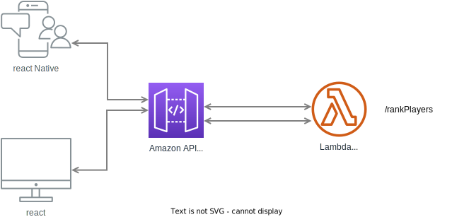

# Overview

The Texas Hold'em Hand Ranker is a web application that allows users to input the community cards and player hands and receive the rank of each player's hand.

## Architecture

The Texas Hold'em Hand Ranker is a single-page React application. 

### real case analysis
In the real world use case , if  we expected high volume of hits for this application, serverless architure is used. The front-end communicates with a back-end API (/rankPlayers)that calculates the rank of each player's hand. The back-end API is written in nodejs and a AWS Lambda function so it automaticall scales. The back-end API receives the community cards and player hands as input and returns the rank of each player's hand. In the real use case , depending on where the access will be , assuming we need fast access with low latency. The Load balander and CDN maybe used as well 



### actual implementation
In the demo , the calculation logic (rankPlayers) will be integrated in he react component as a utility function so it will be easier to review and go over the details


## Technology Stack
Front-end: React
Back-end: nodejs (AWS lambda)

## User Work Flow

1.The user inputs the community cards.
2.The user inputs each player's hand.
3.The user submits the community cards and player hands to the back-end API.
4.The back-end API calculates the rank of each player's hand and returns the results to the front-end.
5.The front-end displays the rank of each player's hand to the user.

## Data Model
The data model consists of the community cards and each player's hand. Each card is represented as an string with a suit and a value property for example '3D'. The community cards are represented as an array of card strings. Each player's hand is represented as an array of card strings.
```    Community: ["3D", "KH", "AS", "5C", "9D"],
    Joe: ["3S", "6H"],
    Sam: ["2C", "JS"],
    Ken: ["2D", "JH"]
```


## APIs

/rankPlayers will be exposed as a lambda function 
sample payload:
```
    payload ={
        Community: ["3D", "KH", "AS", "5C", "9D"],
        Joe: ["3S", "6H"],
        Sam: ["2C", "JS"],
        Ken: ["2D", "JH"]
    }

```
In this current implementation , for easy access on code rankPlayers is servered as a utility function

## User Interface

The user interface consists of a header, a container for the community cards, a container for each player's hand, and a footer.

The header displays the name of the application and a brief explanation of how to use the application.

The community cards container allows users to input the community cards. Each community card is represented by an image of a playing card.

The player hand containers allow users to input each player's hand. Each player hand container displays the name of the player and a series of input fields where users can input each card in the player's hand. Each card is represented by an image of a playing card.

The card component helps to visulize a single card to display them on the main page

The rankDisplay function will responsible to generate the ranked view

The footer displays a message indicating that the application is a single-page React application.


## Tasks

start with create-react-app 

1. set up overall layout structure - header, footer, body 
2. create card component to represent the visual card in a deck
3. create cards container which controls and display all cards in a deck 
4. create TableConatiner which generically controls card distribution to players and community 
5. create RankUtil holds the calculation logic to rank a player ( this will be a AWS Lambda in the future)


## Test plan

Jest Unit test to have most functionality covered , especically the core calculation Unit
